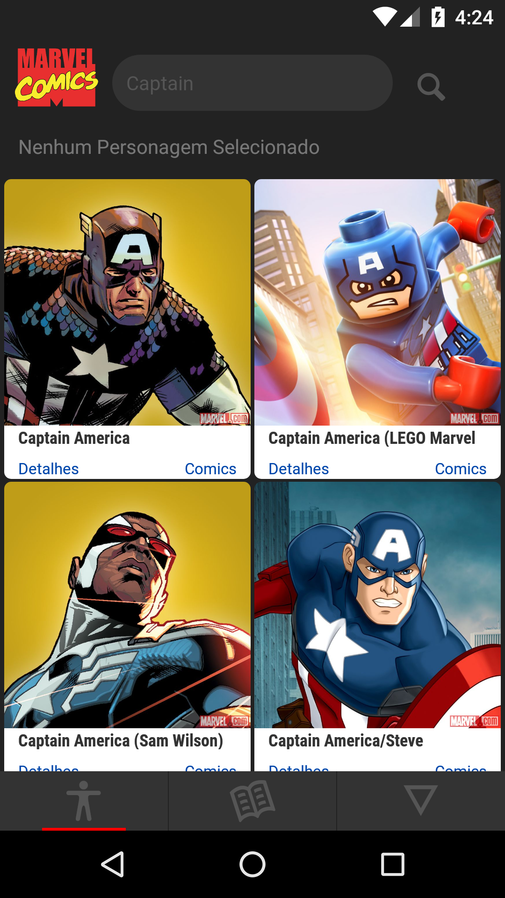
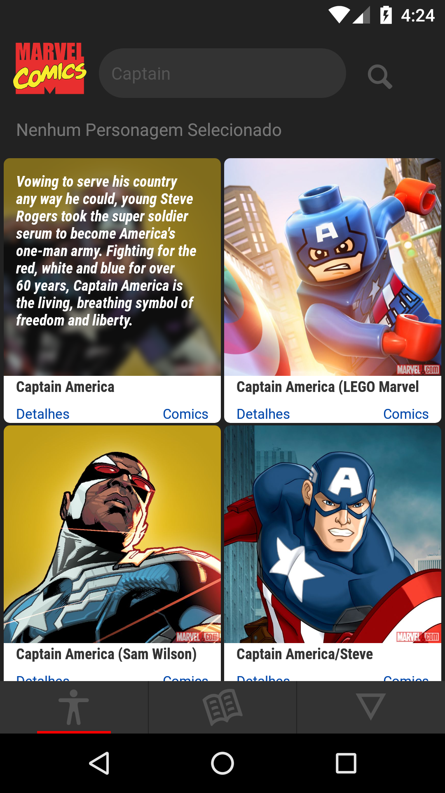
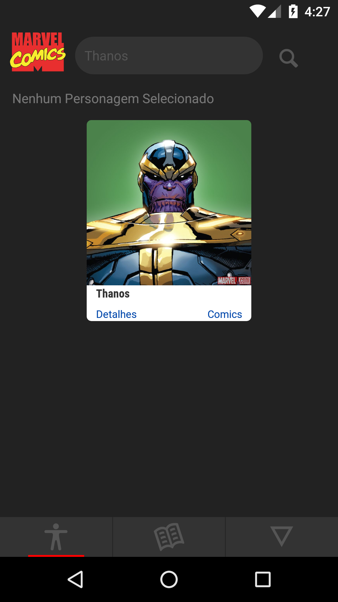
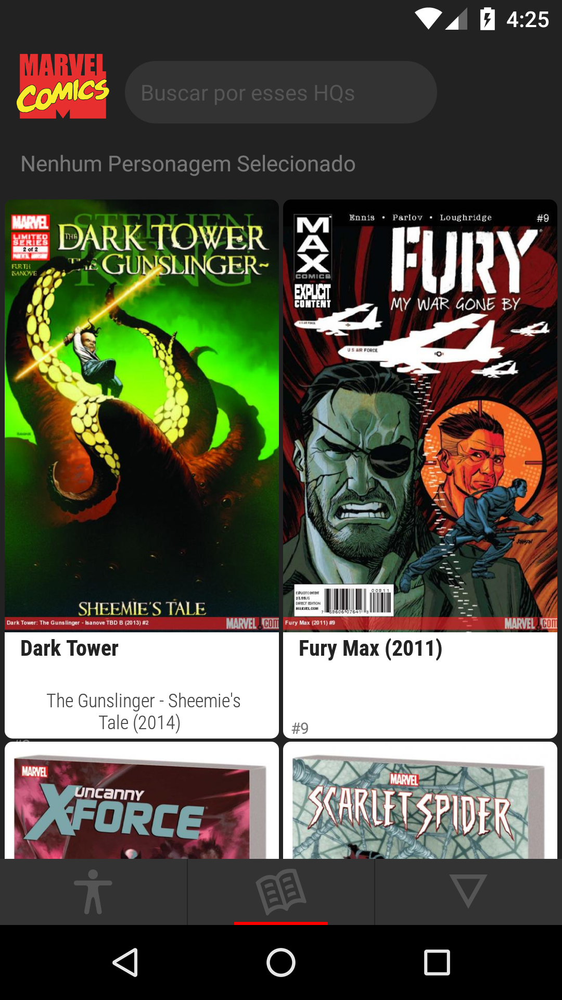
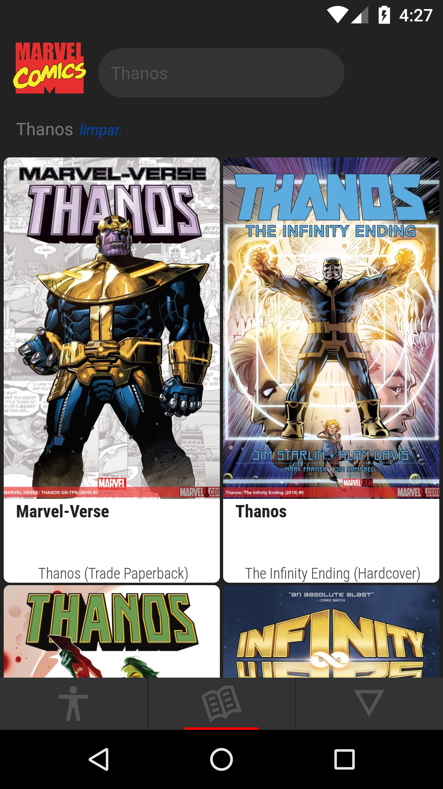
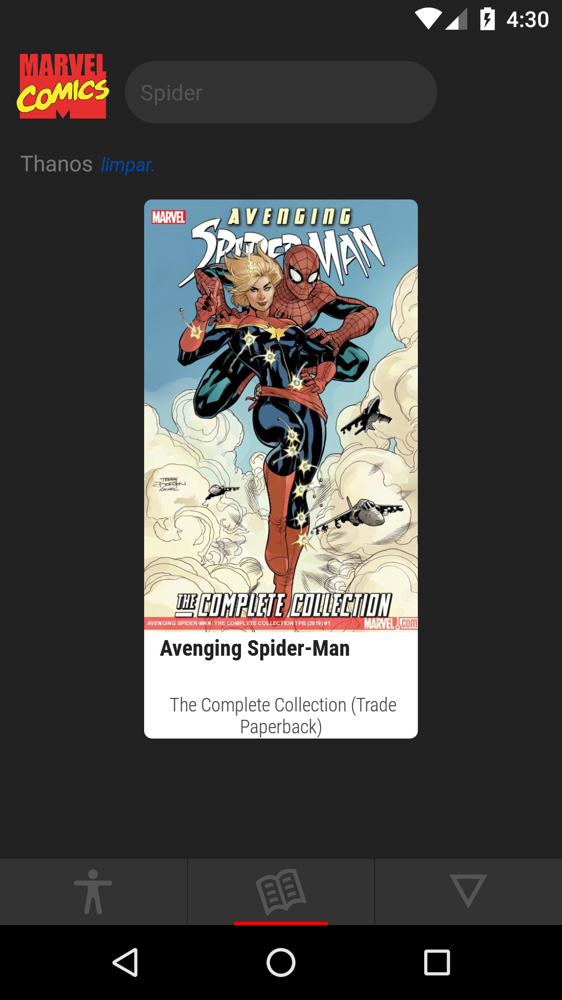
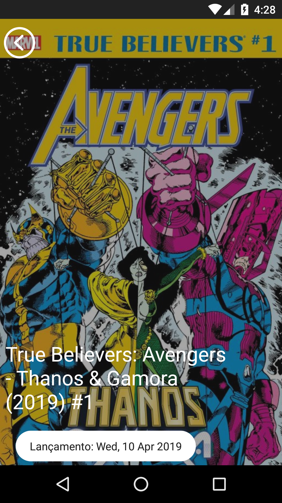
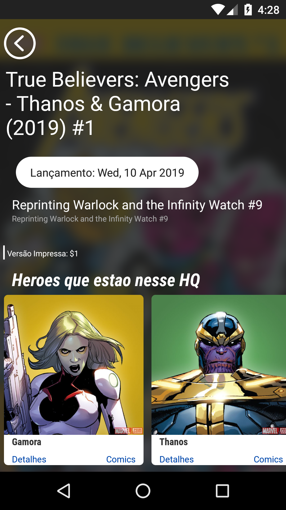
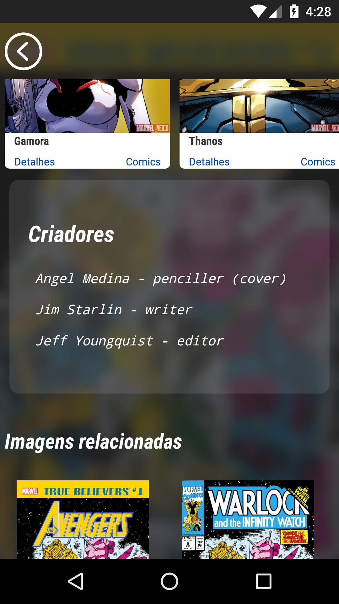
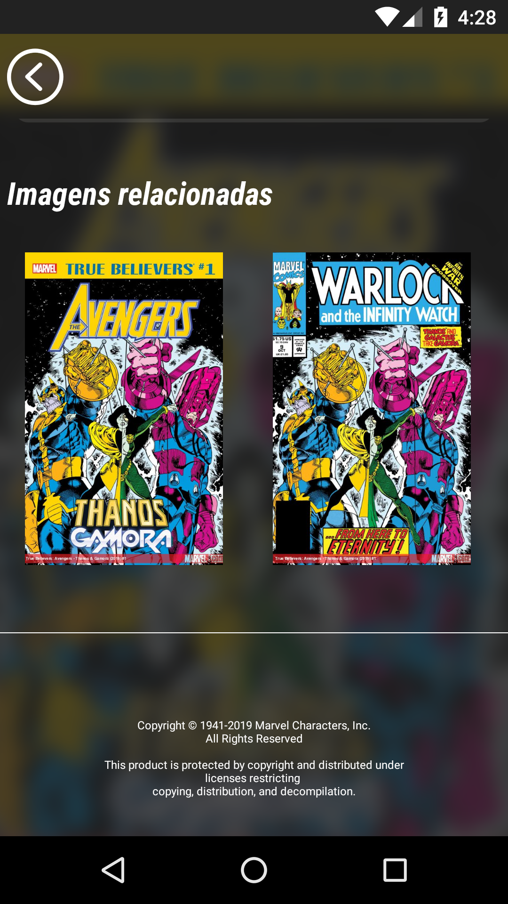

  </img>
  

    <h1>Marvers</h1>
    <h3>Aplicação que ajuda pesquisar seu quadrinho com base nos personagens.</h3>
    
  

# Instalação

Clone o repositório APP: `git clone https://github.com/Tesse-rato/Marvers.git`  

#### Instalar dependencias

Com o repositório em sua máquina rode os comandos `npm install` ou `yarn install`  

> O aplicativo vem configurado com uma baseURL para meu servidor local sem ele o app não abrirá  
> Se voçê está instalando todo ambiente tem deve ficar atento a algum detalhes!

##### Quero instalar também o backend

Se você optou por testar o app junto ao backend cole ele do repositório: `git clone https://github.com/Tesse-rato/Marvers.git`

Fique atento pois você deve criar duas variavéis de ambiente com as chaves da Marver para obter acesso ao API da marvel com um token de autenticação! Se você não sabe que chaves são essas você pode criar uma conta de desenvolvedor no site da [Marvel](https://developer.marvel.com/), siga as istruções para obter suas chaves de acesso.

Apartir daqui presumimos que você conseguiu suas chaves de acesso, agora precisa criar duas variaveis de ambiente.
- MARVEL_KEY = **Sua Chave Pública**
- MARVEL_SEC = **Sua Chave Secreta**

Teste o servidor fazendo uma requisição para **/auth** e deverá ser retornado dados com o token de autenticação para sua conta de desenvolvedor.

## Como funciona

  </img>
  </img>
  </img>

Pra tentar facilitar as coisas começamos a busca por um personagem, você pode clicar na caixa de pesquisa e buscar os personagem num cache do servidor local da aplicação, ate no momento são 1493 personagens catalogados pela [Marvel](https://www.marvel.com).

Depois de encontrar o personagem que você procura, ou encontrar algum personagem que faz parte da Comic que voce está buscando, clique no **Botao Comic** daquele **Heroi** e você vai encontrar uma lista com **Comics** onde aquele personagem participou da história. Se tiver um poco difícil encontrar você pode tentar encontrar pela barra de busca!

## Tela Comics

  </img>
  </img>
  </img>

Se nenhum personagem foi selecionado na tela de personagens, você recebe uma ordem aleatoria de **Comics**, sao mais de 45000 unidades catalogadas pela [Marvel](https://www.marvel.com). Parece que todo dia você vai encontrar comics que você provavelmente não conhece!

Se tiver difícil encontrar aquela que você procura em meio de tantas unidades, você também consegue buscar pela barra pela comic que você está procurando!

Depois de buscar o personagem, abrir as comics onde ele aparece.. encontramos um quadrinho do **Spider-Man** que o **Thanos** participa da história, muito legal né?!

## Encontrei a Comic

Você encontrou sua **Comic** e quer informações dela como **Data de Lançamento**, **Criadores**, **Personagens**. Está tudo lá, uma descrição da comic, personagem que nela aparece, seus criadores e cada função para tal designada na produção e até valores aproximados da versão **Digital** ou **Impressa** da comic, voce pode conferir antes de comprar aquela comic rara que pode valer alguns 🌽🌽🌽!

  </img>
  </img>

  </img>
  </img>

## Agradecimentos

Se você leu ate aqui, obirgado pela atenção e se quiser cologborar com o projeto eu fico muito agradecido, deixe boas praticas de codigos e vamos fomentar a comunidade! Obrigado!  

Bruno França

# Contatos
[**Facebook**](https://www.facebook.com/BrunoFrancaM)  
[**Github**](https://www.github.com/Tesse-rato)  
[**Linkedin**](https://www.linkedin.com/in/bruno-frança-2799b1166)  
[**Instagram**](https://www.instagram.com/salve_franca/)